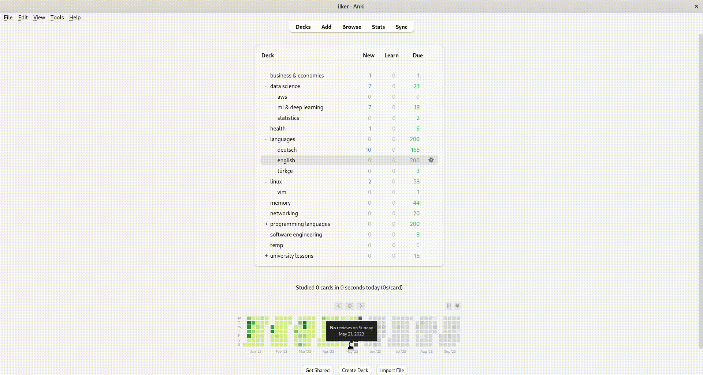

# google-tts-anki-addon

## Introduction
This Anki add-on allows you to retrieve the pronunciation of words by making API calls to Google text-to-speech service. It enhances your language learning experience by providing accurate audio pronunciations for the words in your Anki flashcards.

## Installation
Make sure you have installed `anki` in your computer.
<br><br>
On Linux, clone the repository
```
$ git clone git@github.com:ilkermeliksitki/google-tts-anki-addon.git
```
Link the add-on to `anki`, to do this first switch the add-ons folder
```
$ cd ~/.local/share/Anki2/addons21/
```
Create a symbolic link to the add-on
```
$ ln -s /path/to/repository/src/google_tts_anki_addon/ google_tts_anki_addon
```
Enter you google cloud api key, as shown in the following gif.
<br><br>


## Usage
Either use the default key stroke `q`, or use by clicking `Tools > Google-TTS API`
<br><br>

